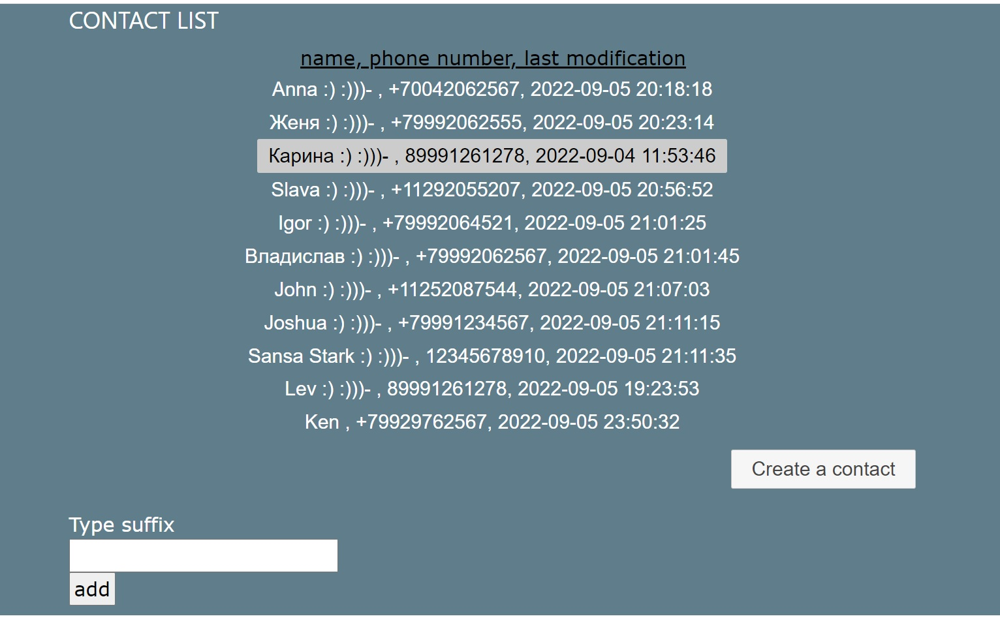
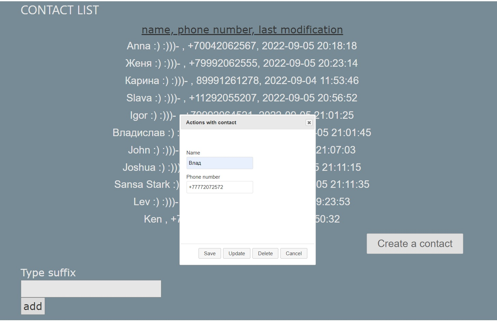

# Phone Book

-Одностраничное приложение с функциональностью телефонной книги.

-Всё взаимодействие с сервером (с БД) с помощью AJAX-запросов без перезагрузки страницы. Возможно создавать,
 удалять, изменять записи; смотреть дату последней модификации записи; добавлять суффикс для имени сразу всем записям

-Конфигурация: database PostgreSQL, JPA provider - Hibernate.

    
Скриншоты страницы и диологового окна

    
    

Для того, чтобы запустить приложение на вашем хосте, вам необходимо создать файл<i>application.properties</i> в папке 
<i>/src/main/resources/</i> с данными для подключения к БД (шаблон - file <i>application.properties.origin</i>
в той же папке)

